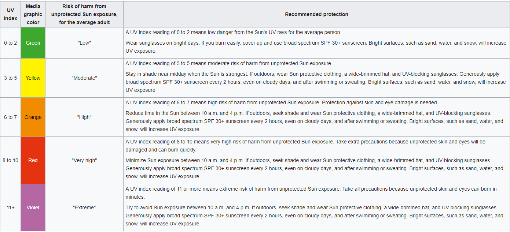
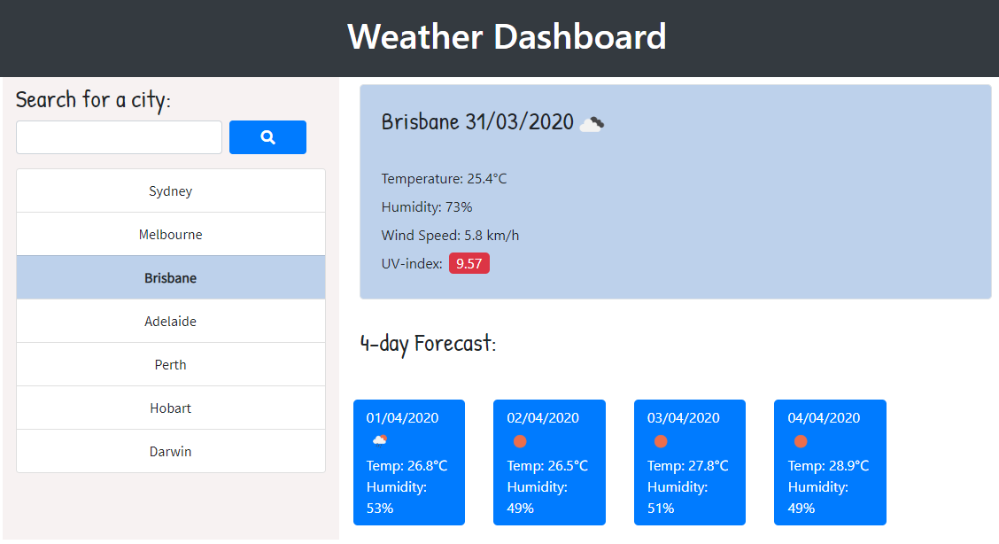

# weather-dashboard

This page should uses the openweather API to return weather data for the weather conditions of a given city.
The site lists Australians capital cities that can be selected and accept a text input to search on.
The searches need to be appended to the list on the page to show a search history.

The site provides the current Temperature, wind peed and humidity and does another API call to provide UV-index information. It is color coded as per the UV index standards as follows.

The site provides a 4 day forecast via another API call. This returns data corresponding to the time of day the search is done.

The site also uses local storage to save the last searched city so that when the page is reloaded then it can immediately recover and display weather data for that city location.

URL of the hosted page
https://craigfbarry.github.io/weather-dashboard/

Github URL
https://github.com/craigfbarry/weather-dashboard

